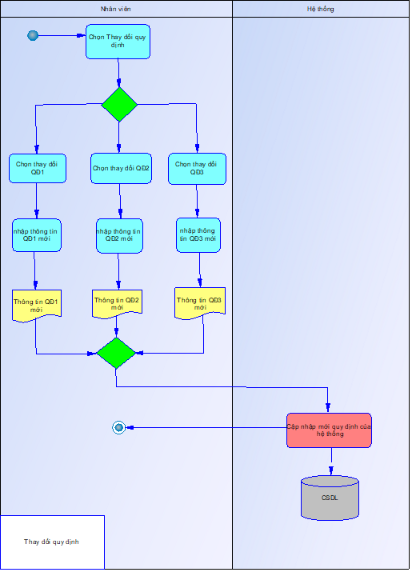

**Công nghệ phần mềm**

Xác định và mô hình hoá yêu cầu

GVHD: Đỗ Như Tài

Nhóm 4 (DCT121C5):

Đặng Quang Duy Anh – 3121411012

Nguyễn Ngọc Huyền – 3121411090

Dương Vũ Nghĩa – 3121411145

Mục lục

1. Yêu cầu phần mềm	
1. Mô hình hoá quy trình nghiệp vụ	
1. Phân tích ngữ cảnh nghiệp vụ	
1. Mô hình ngữ cảnh	
1. Mô hình hoá yêu cầu dùng Use Case	
1. Sơ đồ lớp mức phân tích	
1. Sơ đồ lớp mức thiết kế	

**Kiến thức lý thuyết**

**1. Yêu cầu phần mềm**

- Yêu cầu chức năng:
  - Lập phiếu nhà sách
    - Biểu mẫu phiếu nhập sách

|**BM1**|**Phiếu nhập sách**|||||
| :-: | :-: | :- | :- | :- | :- |
|Ngày nhập: ...||||||
|**STT**|**Sách**|**Thể loại**|**Tác giả**|**Số lượng**|**Đơn giá nhập**|
|1||||||
|2||||||

- Quy định 1: Số lượng nhập ít hơn 150. Chỉ nhập các sách có lượng tồn ít hơn 300.
- Lập hoá đơn bán sách
  - Biểu mẫu hoá đơn bán sách

|**BM2**|**Hoá đơn bán sách**|||||
| :-: | :-: | :- | :- | :- | :- |
|Họ tên khách hàng: ......................|Ngày lập hoá đơn: .......................|||||
|**STT**|**Sách**|**Thể loại**|**Số lượng**|**Đơn giá bán**||
|1||||||
|2||||||
|
Tổng tiền:....................

Số tiền trả:....................

Còn lại:....................
||||||

- Quy định 2: Chỉ bán cho các khách hàng nợ không quá 20.000 và đầu sách có lượng tồn sau khi bán ít nhất là 20. Đơn giá bán = 105% x Đơn giá nhập.
- Tra cứu sách
  - Biểu mẫu danh sách sách

|**BM3**|**Danh sách Sách**||||
| :-: | :-: | :- | :- | :- |
|**STT**|**Sách**|**Thể loại**|**Tác giả**|**Số lượng**|
|1|||||
|2|||||

- Lập phiếu thu tiền
  - Biểu mẫu phiếu thu tiền

|**BM4**|**Phiếu thu tiền**||
| :-: | :-: | :- |
|
Họ tên khách hàng:	

Điện thoại:	

Ngày thu tiền: 	
|
Địa chỉ:	

Email: 	

Số tiền thu: 	
||

- Quy định 4: Số tiền thu không vượt quá số tiền khách hàng đang nợ
- Lập báo cáo tháng
  - Biểu mẫu báo cáo tồn

|**BM5.1**|**Báo cáo tồn**||||
| :-: | :-: | :- | :- | :- |
|Tháng:	|||||
|**STT**|**Sách**|**Tồn đầu**|**Phát sinh**|**Tồn cuối**|
|1|||||
|2|||||

- Biểu mẫu báo cáo công nợ

|**BM5.2**|**Báo cáo công nợ**||||
| :-: | :-: | :- | :- | :- |
|Tháng:	|||||
|**STT**|**Khách hàng**|**Nợ đầu**|**Phát sinh**|**Nợ cuối**|
|1|||||
|2|||||

- Thay đổi quy định
  - Người dùng có thể thay đổi các quy định sau:
    - QĐ1: Thay đổi số lượng nhập tối thiểu, lượng tồn tối thiểu trước khi nhập.
    - QĐ2: Thay đổi tiền nợ tối đa, lượng tồn tối thiểu sau khi bán.
    - QĐ4: Sử dụng hay không sử dụng qui định này.
- Yêu cầu phi chức năng:
  - Yêu cầu về giao diện
    - Yêu cầu chung:
      - Đơn giản, dễ hiểu
      - Sử dụng Tkinter để tạo giao diện nhằm phù hợp với ứng dụng được viết bằng Python
      - Giao diện nhất quán về phông chữ, màu sắc và kiểu dáng các nút bấm
    - Tính khả dụng:
      - Thông báo lỗi rõ ràng với trường hợp nhập sai hay nhập thiếu
      - Hiển thị hướng dẫn bằng văn bản trong ô nhập (Vd: Nhập tên khách hàng)
      - Khung ứng dụng phù hợp với độ phân giải màn hình
  - Yêu cầu về hiệu năng, bảo mật, khả năng bảo trì,...
    - Hiệu năng:
      - Hoạt động hiệu quả, duy trì liên tục với mọi chức năng
      - Tối thiểu thời gian chờ khi thực hiện các chức năng và khi thay đổi chức năng
      - Có thể chịu được cơ sở dữ liệu lớn mà không ảnh hưởng đến hiệu năng
    - Bảo mật
      - Đảm bảo bảo mật thông tin người dùng và thông tin trong hệ thống
      - Thêm màn hình đăng nhập
      - Thêm chức năng xuất dữ liệu trên bộ nhớ
    - Khả năng bảo trì
      - Đảm bảo hệ thống dễ dàng bảo trì và mở rộng
        - Xây dựng codebase theo sơ đồ 3 lớp
        - Xây dựng hàm dễ đọc, dễ hiểu kèm theo chú thích
      - Dùng git để quản lý việc chỉnh sửa ứng dụng
      - Tiến hành kiểm thử liên tục

**2. Mô hình hoá yêu cầu nghiệp vụ**

- **Lập phiếu nhập sách:**

- **Lập hoá đơn bán sách**
  
- **Tra cứu sách**
  

- **Lập phiếu thu tiền**
  

- **Lập báo cáo tháng**
  

- **Thay đổi quy định**

**

**3. Phân tích ngữ cảnh nghiệp vụ**

- Mục tiêu nghiệp vụ

Nhà sách muốn xây dựng một hệ thống phần mềm để:

- Quản lý thông tin sách, doanh thu, hoá đơn, và tạo báo cáo
- Tăng độ chính xác so với cách làm thủ công.
- Cung cấp dữ liệu theo thời gian thực để có thể đưa ra kế hoạch phát triển phù hợp

- Các bên liên quan (Stakeholders)

|Bên liên quan|Vai trò/Nhu cầu|
| :- | :- |
|Quản lý nhà sách|Quản lý kho, theo dõi doanh số|
|Nhân viên nhà sách|Nhập sách, tra cứu sách và in hoá đơn|
|Nhân viên kho/thống kê|Viết báo cáo|
|Quản trị viên|Phát triển, bảo trì và nâng cấp hệ thống|

- Quy trình nghiệp vụ hiện tại (tóm tắt)

Hệ thống quản lý nhà sách có 6 nghiệp vụ chính:

1. Lập phiếu nhập sách 
1. Lập hóa đơn bán sách
1. Tra cứu sách 
1. Lập phiếu thu tiền
1. Lập báo cáo tháng 
1. Thay đổi quy định 

- Hệ thống hiện tại và các hạn chế
1. Thiếu khả năng tích hợp các chức năng quản lý kho, xuất hoá đơn và báo cáo.
1. Không có hệ thống theo dõi công nợ và tồn kho.
1. Dữ liệu rời rạc, không đồng bộ giữa các chức năng quản lý.

- Nhu cầu thay đổi
1. Tích hợp quản lý kho, báo cáo, hoá đơn và phiếu thu tiền vào một hệ thống
1. Cung cấp dữ liệu thời gian thực về tồn kho và doanh thu
1. Lưu trữ và truy xuất thông tin sách và khách hàng dễ dàng và an toàn hơn.

**4. Mô hình ngữ cảnh**

**5. Mô hình hoá yêu cầu dùng Use Case**

**Sơ đồ Use case hệ thống**:

**Mô tả quy trình**

**Import Books (Phiếu nhập sách)**

Đối tượng: quản lý kho, hệ thống

Thao tác:

1\. Quản lý kho vào menu và chọn phiếu nhập sách

2\. Hệ thống hiển thị form phiếu nhập sách

3\. Quản lý kho nhập tìm tên sách vào hệ thống

4\. Hệ thống thêm mục sách vào hệ thống nếu sách chưa tồn tại trong hệ thống và tiến hành 4a. Nếu sách đã tồn tại, tiến hành 4b.

4a. Quản lý kho nhập thể loại, tác giả, số lượng và đơn giá nhập

4b. Quản lý kho nhập đơn giá nhập	

5\. Hệ thống lưu số sách cũ vào tồn đầu

6\. Hệ thống cộng số sách nhập vào hệ thống, sách mới sẽ mặc định ban đầu =0.

7\. Hệ thống thêm số sách đã nhập vào phát sinh báo cáo tồn sách. 

Sơ đồ use case: 

**Book Invoice (Hoá đơn)**

Đối tượng: khách hàng, nhân viên bán hàng, hệ thống

Thao tác:

1\. Khách hàng tiến hành chọn sách để mua và ra quầy thu ngân

2\. Nhân viên bán hàng chọn menu và chọn hoá đơn

3\. Hệ thống hiển thị form hoá đơn

4\. Nhân viên bán hàng nhập tên khách hàng, ngày lập hoá đơn, tên sách, thể loại, số lượng mua

5\. Hệ thống hiển thị đơn giá bán và tổng tiền hoá đơn

6\. Nhân viên bán hàng nhập số tiền khách hàng trả

7\. Hệ thống thêm số tiền còn nợ của khách hàng vào phát sinh công nợ, thêm số lượng sách đã bán vào phát sinh

Sơ đồ use case: 

**Book List (Danh sách Sách)**

Đối tượng: tất cả nhân viên và quản trị viên, hệ thống

Thao tác:

1\. Nhân viên hoặc quản trị viên mở menu và chọn hiển thị danh sách sách

2\. Hệ thống hiển thị danh sách sách hiện có trong hệ thống, bao gồm tên sách, thể loại, tác giả và số lượng 

Sơ đồ use case: 

**Receipts (phiếu thu tiền)**

Đối tượng: khách hàng, nhân viên bán hàng, hệ thống

Thao tác:

1\. Nhân viên bán hàng mở menu, chọn phiếu thu tiền và nhập thông tin khách hàng

2\. Hệ thống tự động điền ngày thu tiền là ngày lập phiếu và số tiền thu. Số tiền thu không lớn hơn số tiền đang nợ trong hệ thống

3\. Nhân viên bán hàng gửi phiếu thu tiền cho khách hàng

4\. Khách hàng tiến hành trả tiền cho nhân viên bán hàng

5\. Hệ thống xác nhận phiếu và thêm số tiền thu vào phát sinh công nợ trong hệ thống

Sơ đồ use case: 

**Inventory Report (Báo cáo tồn)**

Đối tượng: nhân viên kiểm kê, hệ thống

Thao tác:

1\. Nhân viên kiểm kê mở menu và chọn báo cáo tồn

2\. Hệ thống hiển thị danh sách tồn, bao gồm tháng lập báo cáo, tên sách, tồn đầu, phát sinh, tồn cuối

Tháng: tháng hiện tại

Tồn đầu: lưu từ nhập sách hoặc tồn cuối trước

Phát sinh: lưu từ nhập sách hoặc hoá đơn mua sách, có thể âm

Tồn cuối: = tồn đầu + phát sinh

**Debt Report (Báo cáo công nợ)**

Đối tượng: nhân viên kiểm kê, hệ thống

Thao tác:

1\. Nhân viên kiểm kê mở menu và chọn báo cáo công nợ

2\. Hệ thống hiển thị danh sách tồn, bao gồm tháng lập báo cáo, tên khách hàng, nợ đầu, phát sinh, nợ cuối

Tháng: tháng hiện tại

Nợ đầu: lưu từ hoá đơn hoặc tồn cuối trước

Phát sinh: lưu từ hoá đơn mua sách và phiếu thu tiền, có thể âm

Nợ cuối: = nợ đầu + phát sinh

Sơ đồ use case:  

**Exception change (Thay đổi quy định)**

Đối tượng: Quản trị viên, hệ thống

Thao tác:

1\. Quản trị viên chọn menu và chọn mục thay đổi quy định chức năng hệ thống

2\. Hệ thống hiển thị danh sách quy định

3\. Quản trị viên chọn quy định cần thay đổi và nhập thay đổi

4\. Hệ thống lưu vào cơ sở dữ liệu

Sơ đồ use case: 

**6. Sơ đồ lớp mức phân tích**

**

**7. Sơ đồ lớp mức thiết kế**

**BookstoreApp**

\+ main\_menu(): void

+import\_books\_menu(): void

\+ create\_invoice\_menu(): void

\+ show\_books(): void

**BookstoreService**

\+ import\_books(title, genre, stock, cost\_price): void

\+ create\_invoice(customer\_name, title, quantily): void

\+ get\_books(): List<Book>

**Invoice**

\+ invoice\_id: integer

\+ custemer\_name: String 

\+ invoice\_date: date

\+ book\_id: integer

\+ quantity: integer

\+ total\_price: Float

\+ create\_invoice(customer\_name, book\_id, quantity): void

\+ calculate\_total\_price(quantity, sell\_price): Float

**InventoryReport**

\+ book\_id: integer

\+ innitial\_stock: integer

\+ arise: integer

\+ final\_stock: integer

\+ generate\_inventory\_report(): String

**Book**

\+ id: integer

\+ title: String

\+ genre: String

\+ stock: integer

\+ core\_price: Float

**DAL**

\+ add\_book(...)

\+ get\_book\_by\_title(title): book

\+ update\_stock(book\_id, new\_stock):void

\+ add\_invoice()

\+ get\_all\_books():List<Book>

**Report**

\+ report\_id: integer

\+ report\_month: String

\+ generate\_report(): String

**DebtReport**

\+ customer\_name: String

\+ initial\_debt:Float

\+ arise: Float

\+ final\_debt\_report:(): String

+generate\_debt\_report(): String

